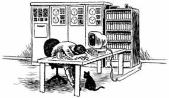
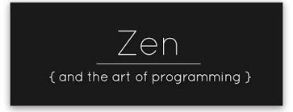

The title says it all. Every struggling student, and I mean absolutely every one of us, hits that point at least once every semester where they get pushed past their wit's end coding for 6 hours straight on a procrastination-induced high. It's a rite of passage I dare say. Amongst the sea of code and emotions we all tend to lose ourselves and bit by bit (get it?) become something that we weren't before. As spiteful as I sound, I don't think making this gruesome transformation is monstrous as it seems, and I'd like to say that there's a silver lining to it all. I'd like to share with the world and discuss my descent to insanity juxtaposed with the birth of my obsession for perfection through my experience learning how to program in C for my Program Structures class.

For the first time in my year and a half of studying Computer Science, I was treated like an adult and had all the training wheels taken off my ride. My instructor, Ravi Narayan, designed the homework around the philosophy of treating the work like a typical developer-client type experience. Both practical and sobering, it was something I hadn't really been given the opportunity about, but I was absolutely interested. The homework took itself very seriously in that he had specified everything, from proper user error handling, specific stubs to fulfill even pinning it all the way down to exact console output and C code formatting. Professionalism was expected and we were expected to follow these guidelines as if our lives depended on it... Boy, did I code like my life depended on it.

As beginners we get away with learning to program to complete the assignment, not necessarily fulfill the given requirements and implementations as it probably should be. In this class, we all got hit with a lethal dose of real world within the first week where our very first assignment was due. We learned to program in C, as mentioned before, using a text editor within the UH Unix system so we got hit with a double whammy right off the start. We go from sitting in our IDE cribs to being put in this helpless environment that doesn't tell us whether or not we made any errors at all. This environment even had the audacity to not display the rest of the function prototype for us. In the mind of a year and a half old programmer, who does that???

I was failing assignments purely on trivial things like not indenting with 4 spaces instead of using the tab key and not right justifying my console output correctly and all of this had me teetering over the edge. For the first few weeks I constantly struggled to stay afloat which had me feeling like a helpless animal. But like all helpless animals stranded in the wilderness, we learn to adapt. I had learned the hard way and became hungry, obsessed even for success. I started writing code on paper, I learned to listen to the client, I hit that space bar four, eight, however many times I needed to in order to attain that sweet 'A' grade. Living life teetering on that cliff you develop a zen gets you through everything. Hours start zooming by when doing work and you start becoming something so startingly better than you were before, minus the sanity.

I talk about my experience in that class like I took a war tour but I believe with all that's left of my mind, that it made me a better programmer and it gave me all the appreciation and patience that I needed to take that next step in my learning. You learn to live without that green check in the corner of your window telling you you did a good job and it's equally rewarding as it is frustrating. There's not enough stress over the stress of learning to do things uniformly and properly because that's what the real world is like. I learned to absorb the chaos of my work and channel it into something positive for myself and I think that's the biggest takeaway from it all. If there's any time you should be listening to the crazy guy talking to you from behind a screen, it's this time.

