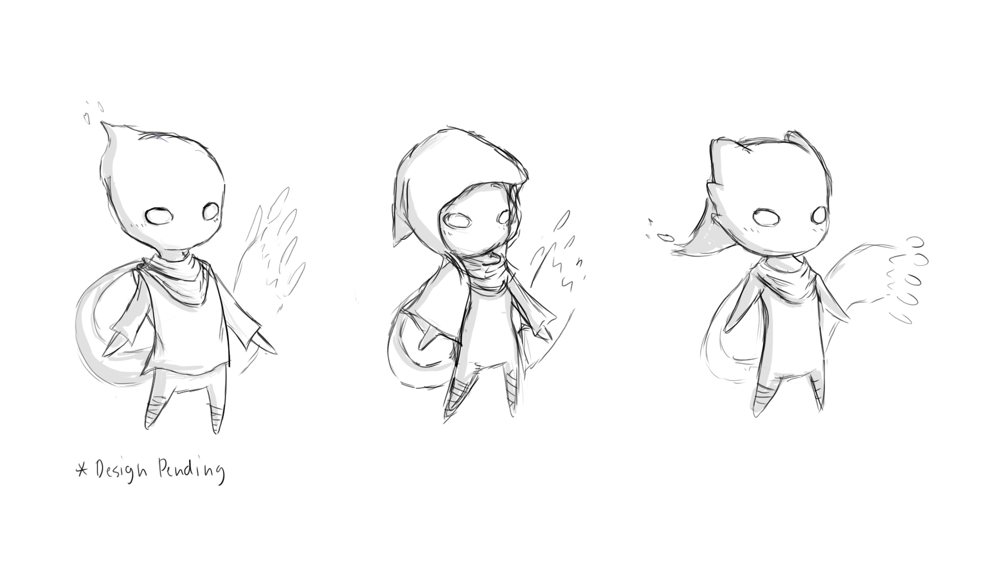

  

Voices of the Land was a collaborative 5 man project between two computer science undergraduate students and three ACM (Academy for Creative Media) students. The idea for the game and story was mine and was developed alongside the rest of my team. The genre of the game is Action Platformer and was worked on from the beginning of the Fall 2017 semester till the end using the Unity Game Engine

My specific role in the group was Project Moderator alongside being one of the primary programmers creating C# scripts in Unity for player movement, camera control, and environment interactions. I also played a mediator of sorts between the programmers and the art team in communicating what would and wouldn't be possible considering the skills of our team, the schedule we were to operate under, and the scope of the project itself.

Almost everything in this game was developed from scratch as we programmers deveoped the code according to how we wanted the game to feel with sounds also being custom made for our game. All of the artwork from concept art, 3D character and environment models, and videowork was done by our artists.

From this project I learned the intimacies of working with a team and the struggle of putting together a relatively complex collaborative effort. Specifically I learned project planning, management skills and how to set and meet deadlines within a group setting. Conflict navigation within a work group proved to be very different from any other job I've experienced so far but as a result I feel that I have developed a different useful set of skills that I can further apply to projects and the workplaces I end up in in the future.

Details regarding earlier iterations and blog posts can be found here on our [website](https://aesplozion.wixsite.com/dynamicdreamers).
