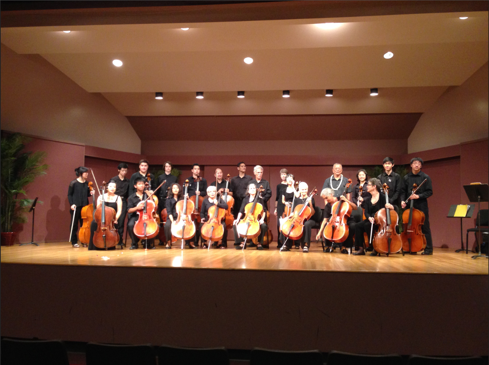

From the age of 9 to 18, I had been playing cello and dedicating a large chunk of my life as a musician and a player. It was one of my biggest hobbies and definitely my proudest one.

As the years went by I had kept playing and got better as I went through various segments of my life. The start of it for me was entering a novice program ran by the Hawaii Youth Symphony for new musicians and after that I moved on to playing for the orchestra of my middle school settling as the cello's Section Leader for my years there. Moving on to high school I started taking formal lessons and met my cello mentor and tutor Stan Kim.

Mr.Kim pushed me harder than I ever did for myself and brought out the talent lying underneath leading me to become the Section Leader again from my junior year in high school all the way to my senior year. Apart from school, he also encouraged me to pursue outside music programs to further refine my skills in a setting where all my peers worked hard and had just as much talent. As a result I ended up auditioning for a position in the Hawaii Youth Symphony for youths of grades 8 to 12 for which I ended up in Hawaii Youth Symphony II, the second highest symphonic orchestra. I stayed as a part of HYS II from 2013-2014 where I had to audition separately for each year landing 7th seat, and Principal Cellist in each respective year.

Towards the end of my time in high school my mentor Mr.Kim had two final destinations for me. First, the University of Hawaii at Manoa orchestra program invited me and the rest of Mr.Kim's students to particpate in a special Cello-only emsemble for which we practiced for two months and was conducted by the esteemed Henry Miyamura who has been a leading figure in Hawaii's orchestral scene for many decades. 

Secondly the high school students all participate in the Solo and Music Ensemble Festival also hosted by the University of Hawaii at Manoa where students were to be judged for a one song performance. My many months of practice leading up to that event landed me an extremely high rating among the judges and an offer for a scholarship to be in the UHM Symphonic Orchestra by one of the judges who was a professor in the music department.

Living life as a musician taught me skills that I wouldn't have been able to learn anywhere else. It pushed me to work towards a craft and taught me what it meant to truly have a passion. It taught me humility knowing that no matter how good I was or thought I was, there was always someone better and that made me realize that no matter what there's always higher heights to strive for. My musical career was long lived and gave me many valuable life lessons to which I still value to this day.

