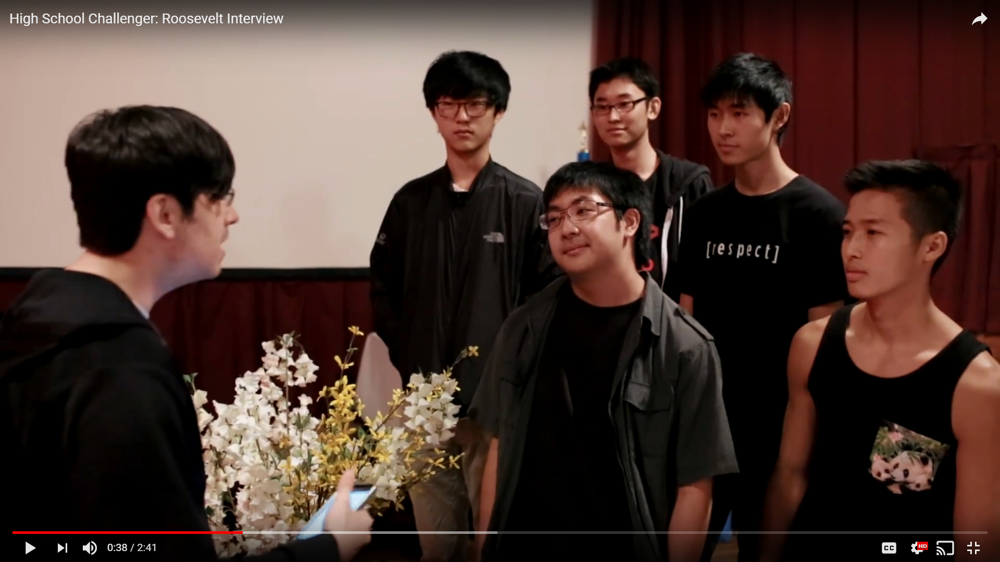

In high school I took the up the role of making an eSports club which comprised of over 50 members at the time. The premise of the club was based around my increasing involvement and interest in the local and national eSports community. I wanted to bring the excitement and feeling of inclusion to my own community within school and foster a sense of teamwork and comraderie that you'd only typically find in a traditional sport.

As president I oversaw activities that primarily existed outside of class given a club meeting within school here and there. I hosted and coordinated tournaments within the school and personally coached a majority of the players and teams that came to meet new friends and strike up new relationships. Although interactions between the entire club were almsot entirely online, it created opportunities for students to interact IRL (in real life) with new people they otherwise would probably have never gotten to know.

My own personal endeavors to participate in local eSports involved creating my own competitive team for the game League of Legends comprised of students within the school. As a team we represented our school and partook in the High School Challenger Series which was hosted by the former company eSports Hawaii in a state-wide 3 month tournament.

The tournament itself was very competitive and led me to push myself in terms of being a leader for a team. I learned leadership skills, schedule planning skills, and networking skills as we had to coordinate with other school's representatives and the overall program director himself. A lot of our hard work paid off in the end as I became close associates with some of the other representatives, some of which I still talk to today, along with the tournament director Quincy Solano becoming one of my close associates and eventually mentor for my high school Senior Project.

